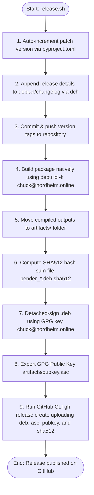

# Klon — System Cloning & Disaster Recovery Guide

Welcome to the **Klon** workstation cloning and disaster recovery manual. Klon is a specialized system administration utility built in Python (GTK4 + Libadwaita) to help GNOME workstation administrators clone, back up, and restore physical Linux volumes in emergencies.

> [!CAUTION]
> **CRITICAL WARNING: ACTIVE TESTING PHASE (v0.2.9)**
> **Klon is currently in the active testing phase and is NOT recommended for production environments.** 
> Using block-level cloning utilities on production storage hosts at this stage carries risk of data loss or corrupted volumes. Limit your use of this software strictly to experimental, verification, or non-critical storage pools.

---

## 🖥️ 1. Core Modules & Tab Views

Klon is organized into distinct functional screens designed to simplify high-stress recovery procedures:

| Diagnostic Screen | Purpose | Low-Level Operations |
| :--- | :--- | :--- |
| **System Clone** | Creates block-level clones of your primary OS drive onto an external drive. | `dd`, block cloning, disk formatting |
| **Recovery Media** | Formats external flash drives and writes a minimal, bootable recovery OS. | `/dev/sdX` formatting, ISO write, bootable structure |
| **Disaster Restore** | Bootable live recovery suite to restore systems from clone blocks. | Bare-metal volume write, partition adjustments |

---

## 🛠️ 2. GUI Polish & Recent Changes (v0.2.0+)

Version `0.2.x` introduces massive usability changes, desktop scaling improvements, and crash fixes:

### UI & Aesthetics Refined
*   **Minimal Bold Navigation:** Replaced complex tab widgets with simplified, text-only bold headers to avoid confusion.
*   **Branding & Identity:** Integrated large branding icons centered at the bottom of each page.
*   **Dynamic About Panel:** Integrates dynamic version discovery and a native License viewer dialog showing full GPL-3.0 terms.
*   **Transparency Fixes:** Fixed application icon transparency, adding a clean circular crop.

### Critical Runtime Fixes
*   **GApplication Chaining Crash:** Solved a critical startup crash caused by misconfigured application initialization chains.
*   **Recovery USB Direct Layout Crash:** Resolved a Gtk Box layout exception caused by hosting `ActionRow` widgets directly in page view holders.
*   **IsoPage Dropdown Regression:** Fixed an `AttributeError` in the ISO builder interface where targets mapped to mismatched dropdown arrays (`target_dropdown` vs `dest_dropdown`).
*   **Restore Page Regression:** Restored missing page components in the restoration setup flow.

---

## 📥 3. Installation & Verification

Klon is compiled and distributed as a native system package (`.deb`).

### Deployment Commands
1.  **Download the Artifacts:** Fetch the `.deb` package file and its hash verification file.
2.  **Verify Package Integrity:**
    ```bash
    sha512sum -c klon_*.deb.sha512
    ```
3.  **Install the Utility:**
    ```bash
    sudo dpkg -i klon_*.deb
    sudo apt-get install -f  # Resolves any missing GTK4/Libadwaita runtimes
    ```

---

## 🏗️ 4. Release & Debian Packaging Pipeline

Klon releases packages and tags repository sources automatically via `release.sh`:



### Released Deliverables
*   **Package Installer:** `artifacts/klon_${VERSION}-1_all.deb`
*   **Detached GPG Signature:** `artifacts/klon_${VERSION}-1_all.deb.asc`
*   **SHA512 Checksums:** `artifacts/klon_${VERSION}-1_all.deb.sha512`
*   **Public Key Certificate:** `artifacts/pubkey.asc`

---
*Klon is open-source software distributed under the GNU General Public License v3.*
